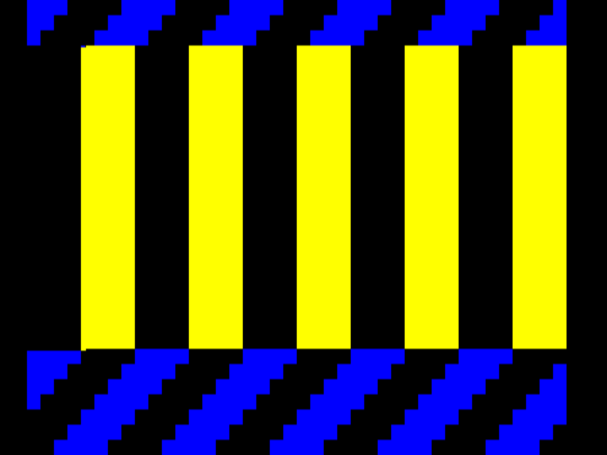
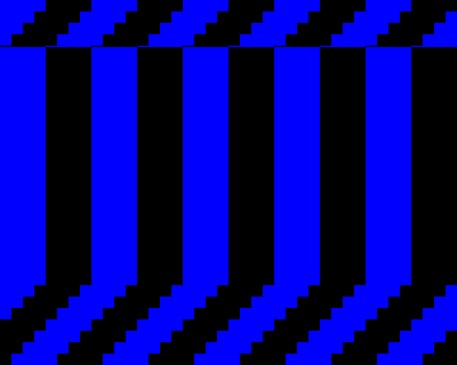

# jnext copper bug: tilemap transparency index is not updated mid-frame

Minimal ZX Spectrum Next test case showing that **jnext** does not honour a
copper `MOVE` to the tilemap transparency index register (nextreg `0x4C`) at the
raster line where the copper writes it, while real Next hardware (and MAME) do.

The same copper program changes two things halfway down the frame: the tilemap
base address (nextreg `0x6E`) and the tilemap transparency index (nextreg
`0x4C`). jnext applies the first one at the right raster line, but not the
second — the whole frame ends up drawn with a single transparency index.

## What the test program does

[src/main.c](src/main.c) sets up the tilemap layer in 40x32 / 320x256 mode with
the attribute byte eliminated, the ULA layer disabled (nextreg `0x68` bit 7) and
the vertical line count offset set to 0, so copper `WAIT` line numbers are raw
raster lines.

Two tilemaps are built in bank 5 ([src/tilemap.asm](src/tilemap.asm)), both made
only of two tiles from `game.fnt`: tile 0 (all pixels palette index 0) and
tile 6 (all pixels palette index 1). Tilemap palette 0 is set to index 0 = blue
(`0x03`) and index 1 = yellow (`0xFC`):

- **tilemap A** — vertical bars (`col & 4`)
- **tilemap B** — diagonal stripes (`(col + row) & 4`)

The copper program then runs once per frame (restarted on every vertical blank):

| line | tilemap base (`0x6E`) | transparency index (`0x4C`) | expected result |
| ---- | --------------------- | --------------------------- | --------------- |
| 0    | tilemap A             | 0                           | index 0 (blue) transparent → **yellow vertical bars** on black |
| 160  | tilemap B             | 1                           | index 1 (yellow) transparent → **blue diagonal stripes** on black |

Both `MOVE`s of a pair are adjacent in the copper list, so they are written on
essentially the same raster line.

## Expected result — [mame.png](mame.png)



MAME (and the real Next hardware, which matches it) shows three bands:

1. a narrow band of **blue diagonals** at the top — the state left over from the
   previous frame's line-160 writes, covering the lines drawn before raster
   line 0;
2. the main band of **yellow vertical bars** — tilemap A with transparency
   index 0;
3. **blue diagonals** again from raster line 160 down — tilemap B with
   transparency index 1.

## Actual result in jnext — [jnext.png](jnext.png)



The geometry is right but the colour is not. The middle band correctly switches
to tilemap A's vertical bars at the same raster line, so the copper is running
and the mid-frame `MOVE` to `0x6E` is applied where it should be. But the bars
are **blue, not yellow**: there is not a single yellow pixel anywhere in the
frame. The whole frame is rendered with transparency index 1 — the value written
at line 160 — as if the write of index 0 at line 0 never happened, or as if
`0x4C` were latched once per frame instead of being sampled per raster line.

This is the inconsistency: within the same copper list, `0x6E` takes effect
mid-frame and `0x4C` does not.

## Building and running

Requires [z88dk](https://z88dk.org) (`zcc` on the `PATH`).

```sh
make          # builds build/copper-bug.nex
make jnext    # runs it in jnext
make mame     # copies it to the SD image and runs it in MAME
```

`make mame` and `make sync` expect a Next SD card image at
`~/bin/next-images/cspect-next-2gb.img` and the `mtools` and
[`txt2bas`](https://github.com/remy/txt2bas) utilities; adjust the variables at
the top of the [Makefile](Makefile) to match your setup.

The raster line at which the copper switches can be moved for further testing:

```sh
make clean && make EXTRA_FLAGS=-DSWITCH_LINE=200
```
