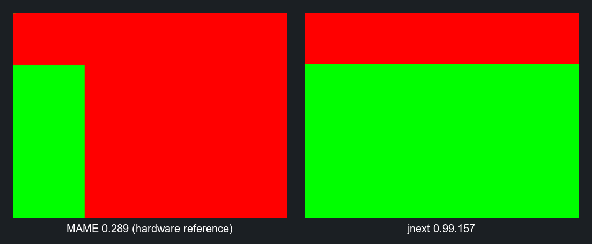
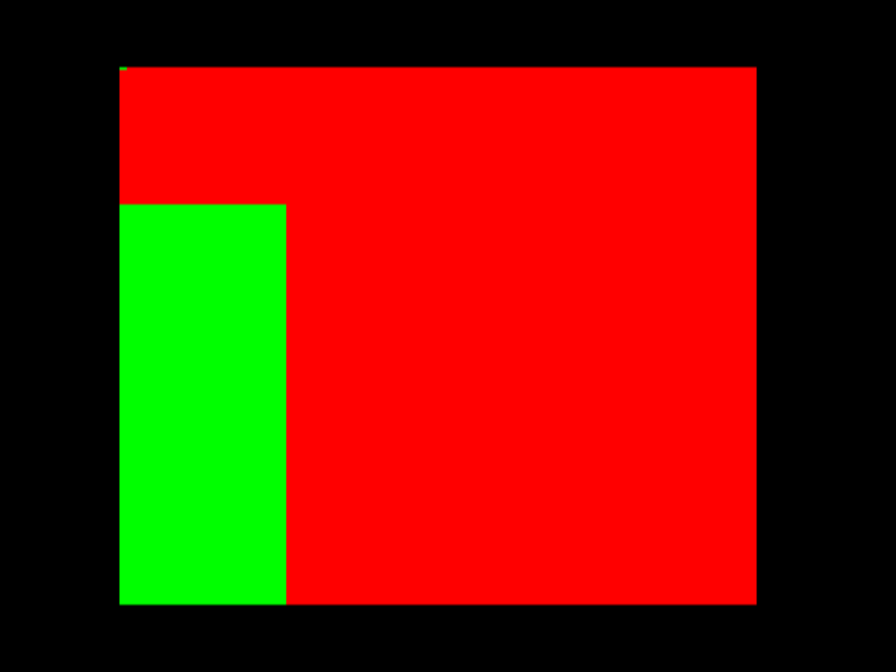
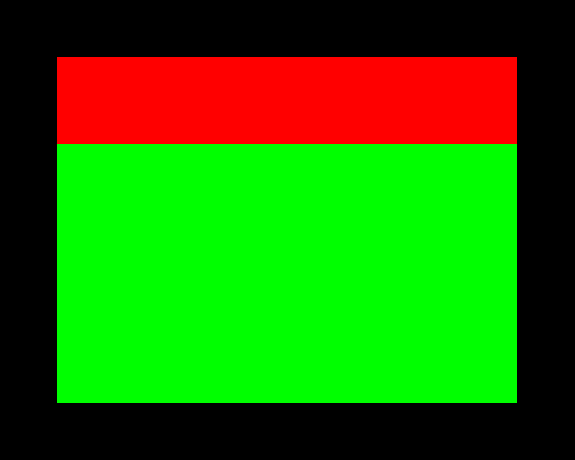

# jnext bug: a copper MOVE part-way along a scanline is applied to the whole line

**Status: reproduces on jnext 0.99.157** (and unchanged since 0.99.155 — the
`make shot` capture is byte-identical on both).

A copper `MOVE` to the Layer 2 active bank register (nextreg `0x12`) that lands
part-way along a scanline is not honoured at the point it is written. The whole
scanline is drawn with the **last** value written on it, so the pixels to the
right of that `MOVE` — which should come from the bank it selects — come from
the bank selected by the following write instead.

Switching the bank *between* lines works correctly, which is what makes this
specific: the copper is running, the register reaches Layer 2, and the change
takes effect at the right raster line. Only its horizontal position is lost.



Both captures cropped to the 256x192 display area and shown at the same scale.

## What the test program does

[main.c](main.c) paints two Layer 2 screens, each three 16K banks, in flat
colour: bank 8 (the machine's default active bank) red, bank 11 (the default
shadow bank) green. The ULA layer is switched off so nothing else is on screen,
and the default Layer 2 palette is `RRRGGGBB`, so no palette setup is needed.

The copper list then runs once per frame, restarted at each vertical blank
(nextreg `0x62` = `0xC0`):

| lines | copper writes |
| ----- | ------------- |
| 0     | `0x12` = 8 once |
| 48–191 | per line: `0x12` = 8 at hpos 8, `0x12` = 11 at hpos 32 |

The control band (lines 0–47) is the part that makes the result readable: it
uses the same register, written by the same copper, and it comes out right.

### A note on the geometry

`hpos 32` lands at x ≈ 256 — that is, at or just past the **right edge** of the
256-pixel display. On hardware it therefore has no visible effect on the line it
is issued on; all it does is leave bank 11 selected for the start of the next
line. So each line of the test band is really *two* regions, not three:

* x = 0 … ≈ 64 — bank 11 (**green**), left over from the previous line
* x ≈ 64 … 255 — bank 8 (**red**), from the `MOVE` at hpos 8

That is what the MAME capture below shows, and it is enough to demonstrate the
bug. The geometry can be moved if a three-region version is wanted — see the
bottom of this file.

## Expected result — [mame.png](mame.png), captured from MAME



MAME renders the mid-line `MOVE` where it is issued:

```
display area x = 193..1215, y = 110..970  (256x192 at ~4x)

y=200  (control band)   RED across the whole line              <- line ~20
y=600  (switched band)  GREEN x=193..459, RED x=460..1215      <- line ~109
y=900  (switched band)  GREEN x=193..459, RED x=460..1215      <- line ~176
```

The green/red boundary sits at x = 460, i.e. display pixel
(460 − 193) / 3.996 ≈ **67**, which is where the copper's `hpos 8` falls: a
`WAIT(line, h=0)` + `MOVE` completes at the start of the 256-wide display, so
`h=8` is 8 × 8 = 64 pixels into it. The band boundary is at y = 331 ≈ line 48,
matching `SPLIT_LINE`.

## Actual result in jnext — [jnext.png](jnext.png)



The control band is **red**, so per-line bank switching is correct. Everything
below line 48 is **solid green** — not one red pixel. The `MOVE` to bank 8 at
hpos 8 has no effect at all; the line is drawn entirely with bank 11, the value
left by the `MOVE` at hpos 32.

Scanline sample from the capture (`make shot`, 640×512, 2× scale):

```
y=153  (control band)   black×64  RED  ×512  black×64      <- correct
y=230  (switched band)  black×64  GREEN×512  black×64      <- should be GREEN then RED
```

## Where it comes from

The copper is not at fault. `Copper::execute` compares
`hc >= (hpos << 3) + 12` ([src/peripheral/copper.cpp:35,143](../../../jnext/src/peripheral/copper.cpp))
and issues the `MOVE` through `nextreg.write()`, which reaches the nextreg
`0x12` handler and `Layer2::set_active_bank`
([src/core/emulator.cpp:1620](../../../jnext/src/core/emulator.cpp)).

The value is then logged for the current scanline **with no horizontal
position** — [src/video/layer2.h:363](../../../jnext/src/video/layer2.h):

```cpp
struct BankChange {
    uint16_t line;
    uint8_t  active_bank;
    uint8_t  shadow_bank;
};
```

and the renderer applies every entry tagged with a line before drawing it —
[src/video/layer2.cpp:238](../../../jnext/src/video/layer2.cpp):

```cpp
while (bank_render_cursor_ < bank_change_count_
    && bank_change_log_[bank_render_cursor_].line == lt) {
    const auto& c = bank_change_log_[bank_render_cursor_++];
    active_bank_ = c.active_bank;        // last write on the line wins
    shadow_bank_ = c.shadow_bank;
}
```

`Renderer::render_frame` then calls `layer2.apply_changes_for_line(row)`
followed by `layer2.render_scanline(...)`, which draws all of the line from the
single surviving bank. Two writes on one line therefore collapse to the second.

The scroll (`0x16`/`0x17`) and clip-window logs next to it have the same shape,
so the same limitation should apply to a mid-line scroll change.

Fixing it means carrying the horizontal position into the log and having
`render_scanline` draw the line in segments rather than in one piece.

This is the limitation documented as a bounded one in
`doc/design/EMULATOR-DESIGN-PLAN.md` §6 and in
`doc/design/PER-SCANLINE-DISPLAY-STATE-AUDIT.md` (jnext GH #170). What this case
adds is that the residual error is **not** bounded to "at most one row, always
early": when two writes land on the same line, the first is lost outright and a
whole horizontal region of the screen is drawn from the wrong bank.

## Why it matters

It is not a corner case. This is how the Next's copper is normally used to put
a strip of a different Layer 2 screen inside a line — for example the moving
advertising hoardings in *next-point*, whose copper does exactly this on each
of the twelve lines of the ad strip:

```c
CU_WAIT(line, 2),                                  /* hoarding starts */
CU_MOVE(REG_LAYER_2_RAM_BANK, ad_bank),
CU_MOVE(REG_LAYER_2_OFFSET_Y, ad_offset),
CU_WAIT(line, 29),                                 /* hoarding ends   */
CU_MOVE(REG_LAYER_2_OFFSET_Y, 0),
CU_MOVE(REG_LAYER_2_RAM_BANK, crowd_bank)
```

Under jnext the strip is drawn entirely from `crowd_bank`, the second write, so
the hoardings never appear — the crowd is shown where they should be.

## Building and running

Requires [z88dk](https://z88dk.org) (`zcc` on the `PATH`) and jnext.

```sh
make CASE=layer2-bank-midline          # build build/layer2-bank-midline.nex
make CASE=layer2-bank-midline jnext    # run it
make CASE=layer2-bank-midline shot     # deterministic headless PNG
make CASE=layer2-bank-midline mame     # run it in MAME (needs an SD image)
```

The geometry can be moved for further testing — this puts both switches inside
the visible line, so hardware shows three regions rather than two:

```sh
make clean && make EXTRA_FLAGS="-DSPLIT_LINE=96 -DSWITCH_ON=4 -DSWITCH_OFF=20"
```
