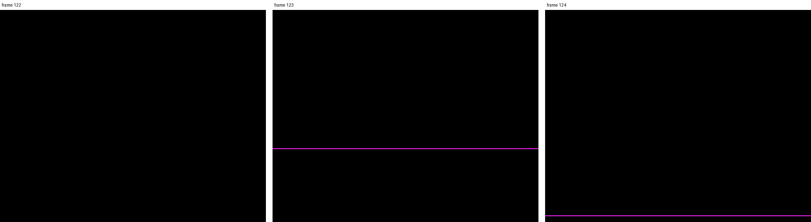

# jnext bug: copper MOVEs issued just before a line boundary are split between two rows

**Status: reproduces on jnext 1.0.30.**

When the copper writes several tilemap registers right at the end of a line,
jnext can apply some of the writes to one row and the rest to the next row.
Which writes land where depends on where the CPU's instruction boundaries
happen to fall in that frame. So a row where the registers disagree appears on
some frames and not on others: a **flickering line**.

This is the reduction of the two flickering pink lines in next-point's
**controls menu**. The menu's copper list is reproduced here almost unchanged.
On hardware and in MAME the menu is stable.



## What the test program does

[main.c](main.c) shows the tilemap alone: the ULA is off and the fallback
colour is black. The tilemap is tile 0 everywhere. There are two tile
definition blocks, and tile 0 is a solid colour in each:

| state | tile definitions (`0x6F`) | tile 0 pixels | transparency index (`0x4C`) | mode (`0x6B`) |
| ----- | ------------------------- | ------------- | --------------------------- | ------------- |
| outside the split | A | index 0 | 0 | 40x32 |
| inside the split  | B | index 1 | 1 | 80x32 |

Palette indices 0 and 1 are both pink. In each state the tile's colour is also
the transparent index, so **the screen must be solid black**. A row turns pink
only when it gets the tile definitions of one state and the transparency index
of the other.

As in next-point, the copper line offset (nextreg `0x64`) is 32, so copper
line *n* is framebuffer row *n*. The CPU runs at 28 MHz. The copper list is
next-point's, with its line numbers:

```c
CU_WAIT(167, 320 >> 3),                    // the menu's (29 - 4*2)*8 - 1
CU_MOVE(0x6F, defs_B),
CU_MOVE(0x4C, 1),
CU_MOVE(0x6B, ENABLE | 80x32),
CU_WAIT(248, 320 >> 3),                    // the menu's (29 + 2)*8
CU_MOVE(0x6F, defs_A),
CU_MOVE(0x4C, 0),
CU_MOVE(0x6B, ENABLE),
CU_STOP
```

After setting up, the CPU sits in an 18 T-state loop ([spin.asm](spin.asm)).
Its length does not divide the frame, so the instruction boundaries drift
against the raster, as they do in any real program.

## Expected result: [mame.png](mame.png), from MAME


Solid black, on every one of 61 consecutive frames (3000–3060) captured from
MAME. MAME's view crops 8 rows at the top and bottom, which hides row 248. The
same check with `-DSPLIT_LINE_2=200`, where both splits are in view, is also
black on all 61 frames.

## Actual result in jnext: [jnext.png](jnext.png)

Most frames are black, but some have a single pink row at exactly one of the
split rows. Over 20 consecutive frames (`make frames`) the pattern repeats with
the loop's drift, every 7 frames:

```
frame 123  pink row 167
frame 124  pink row 248
frame 130  pink row 167
frame 131  pink row 248
frame 137  pink row 167
frame 138  pink row 248
(all other frames 120-139 clean)
```

## Where it comes from

Three things in jnext combine.

1. **When the MOVEs land.** `WAIT(n, 40)` releases at `hc_ula` = 40×8 + 12 = 332
   (copper.vhd:94). `hc_ula` 0 is raw hc 125, and a line has 456, so 332 is raw
   hc 457 − 456 = **1** of the *next* raw line. The three MOVEs follow at
   roughly master cycles 5, 7 and 9 after that raw line boundary: one MOVE,
   then one idle cycle, per instruction.

2. **When the row state is sampled.** `Emulator::on_scanline(N)` is a scheduler
   event at raw hc 0 of line N. It snapshots row N−1's tile definitions and
   transparency index (`snapshot_row_render_state`: `snapshot_fetch_for_line`,
   `snapshot_output_for_line`). It also retags the `0x6B` change log so that
   later writes go to row N (`set_current_nr6b_line`).

3. **The copper runs ahead of the events.** After each CPU instruction,
   `tick_devices_after_instruction` first runs the copper over the whole
   instruction's master-cycle window (`tick_copper_for_master_cycles`), and
   only then calls `run_scheduled_until(clock_)`, which fires the
   `on_scanline` event that was due inside that window.

So when an instruction straddles the boundary, the event fires *after* all the
copper MOVEs that fell inside the same instruction, even though those MOVEs
come *after* the boundary. Those MOVEs are counted as row N−1's; the rest, from
the next instruction, go to row N. When the instruction ends between the `0x6F`
MOVE and the `0x4C` MOVE (a window of a couple of master cycles), row N−1 is
drawn with the new tile definitions and the old transparency index. That row
is pink. Whether that happens depends on the CPU's phase in that frame, which
is why it flickers.

The same split can separate `0x4C` from `0x6B`. It is not visible here because
the tilemap is uniform, but it is another source of the menu's corrupted line.

Two controls support this explanation:

* `-DSPLIT_HPOS=0` moves the MOVEs to the start of the paper, far from any
  `on_scanline` event. Result: clean on all 40 frames tested (120–159).
* The effect needs an instruction boundary inside a window of a few master
  cycles. At 3.5 MHz (`-DCPU_SPEED=0`) this 18 T-state loop visits only three
  phases, and none of them falls in the window, so that build happens to stay
  clean.

A fix probably has to fire due scanline events *inside* the copper loop. That
is, `tick_copper_for_master_cycles` would stop at each `on_scanline` boundary
in the window, run the event, and carry on, so that the row snapshot and the
line tag change at the right master cycle rather than at an instruction
boundary.

## Building and running

```sh
make CASE=tilemap-split-hblank           # build
make CASE=tilemap-split-hblank jnext     # run it (watch rows 167 and 248)
make CASE=tilemap-split-hblank frames    # 20 headless frames into build/frames/
python3 cases/tilemap-split-hblank/pink_rows.py build/frames/*.png
make CASE=tilemap-split-hblank mame      # run it in MAME (needs an SD image)
```

`pink_rows.py` needs Pillow and exits non-zero if any frame has a pink row. A
single frame can be reproduced with `make CASE=tilemap-split-hblank shot
SHOT_FRAME=123`.

Build-time knobs (`make clean && make EXTRA_FLAGS="..."`):

| flag | default | meaning |
| ---- | ------- | ------- |
| `SPLIT_LINE_1`, `SPLIT_LINE_2` | 167, 248 | copper lines of the two splits |
| `SPLIT_HPOS` | 40 | copper WAIT hpos; 0 is the control above |
| `CPU_SPEED` | 3 | nextreg `0x07`: 0 = 3.5 MHz … 3 = 28 MHz |
| `COPPER_LINE_OFFSET` | 32 | nextreg `0x64` |
| `SPLIT_TRANSPARENCY` | 1 | set to 0 as a sanity check: rows 168–247 must then be solid pink |
